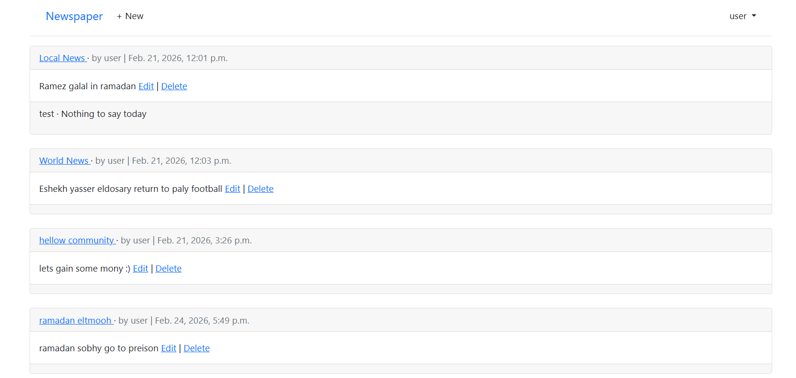
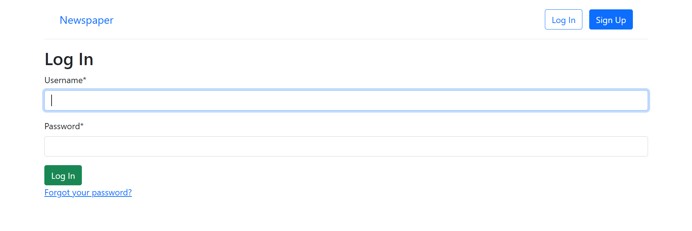

# 📰 Newspaper Website

[](https://www.python.org/downloads/)
[](https://www.djangoproject.com/)
[](https://opensource.org/licenses/MIT)

A robust and modern news publishing web application built using the Django framework. 
This platform empowers users to author, publish, edit, and manage articles while providing a seamless reading experience for the community.

---

## 📑 Table of Contents
- [Project Overview](#-project-overview)
- [Key Features](#-key-features)
- [Technologies Used](#-technologies-used)
- [Project Structure](#-project-structure)
- [Getting Started](#-getting-started)
  - [Prerequisites](#prerequisites)
  - [Installation](#installation)
- [Application Screenshots](#-application-screenshots)
- [Author](#-author)

---

## 🎯 Project Overview

This project serves as a comprehensive news portal where authenticated users can securely manage their publications. Every article features a dedicated page showcasing the full content alongside author details.

Beyond its core functionality, this project was developed to demonstrate proficiency in Django fundamentals, encompassing:
- Advanced Model-View-Template (MVT) architecture
- User authentication and authorization
- Secure database transactions and CRUD operations
- Dynamic template rendering and form handling

---

## ✨ Key Features

- **Robust Authentication:** Secure Sign Up, Log In, and Log Out functionality.
- **Article Management:** Users can seamlessly draft, publish, edit, and delete their own articles.
- **Access Control:** Author-based permissions ensuring users can only modify their respective content.
- **Dynamic Views:** Interactive lists for browsing articles and detailed views for reading them.
- **Responsive Design:** A clean, accessible UI powered by HTML and CSS.

---

## 🛠 Technologies Used

- **Backend:** Python, Django
- **Frontend:** HTML5, CSS3
- **Database:** SQLite (Development)
- **Version Control:** Git

---

## 📂 Project Structure

```text
Newspaper/
│
├── accounts/          # User authentication and profile management apps
├── articles/          # Central app for article models, views, and logic
├── django_project/    # Main project configuration and routing
├── pages/             # Static or semi-static page views (e.g., Home)
├── images/            # Static image assets and upload directory
├── templates/         # Global HTML templates
├── manage.py          # Django command-line utility
└── requirements.txt   # Project dependencies
```

---

## 🚀 Getting Started

Follow these instructions to set up a local copy of the project and get it running on your local machine for development and testing purposes.

### Prerequisites
Make sure you have [Python](https://www.python.org/downloads/) installed on your system. 

### Installation

**1. Clone the repository**
```bash
git clone https://github.com/Mahmoud-Zaid9/Newspaper.git
cd Newspaper
```

**2. Create a virtual environment**
```bash
python -m venv venv
```

**3. Activate the virtual environment**
- **Windows:**
  ```bash
  venv\Scripts\activate
  ```
- **Mac / Linux:**
  ```bash
  source venv/bin/activate
  ```

**4. Install project dependencies**
```bash
pip install -r requirements.txt
```

**5. Apply database migrations**
```bash
python manage.py migrate
```

**6. Launch the development server**
```bash
python manage.py runserver
```

Once the server is running, open your web browser and navigate to:
[http://127.0.0.1:8000/](http://127.0.0.1:8000/)

---

## 📸 Application Screenshots

<details>
<summary>Click to view screenshots</summary>

### Home Page


### Articles Page


### Login Page


### Sign Up Page


</details>

---

## 👨‍💻 Author

**Mahmoud Zaid**  
- GitHub: [@Mahmoud-Zaid9](https://github.com/Mahmoud-Zaid9)